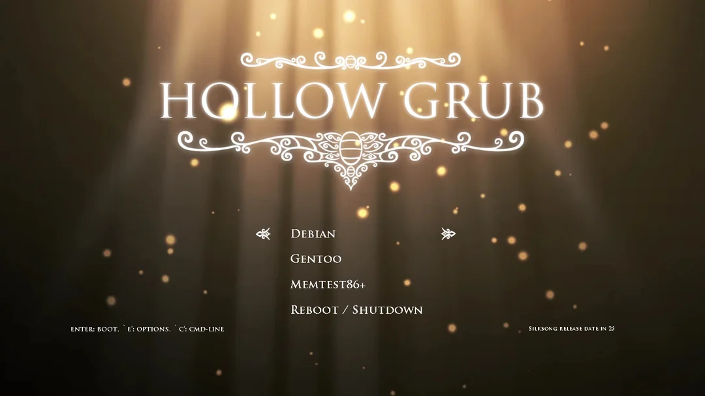
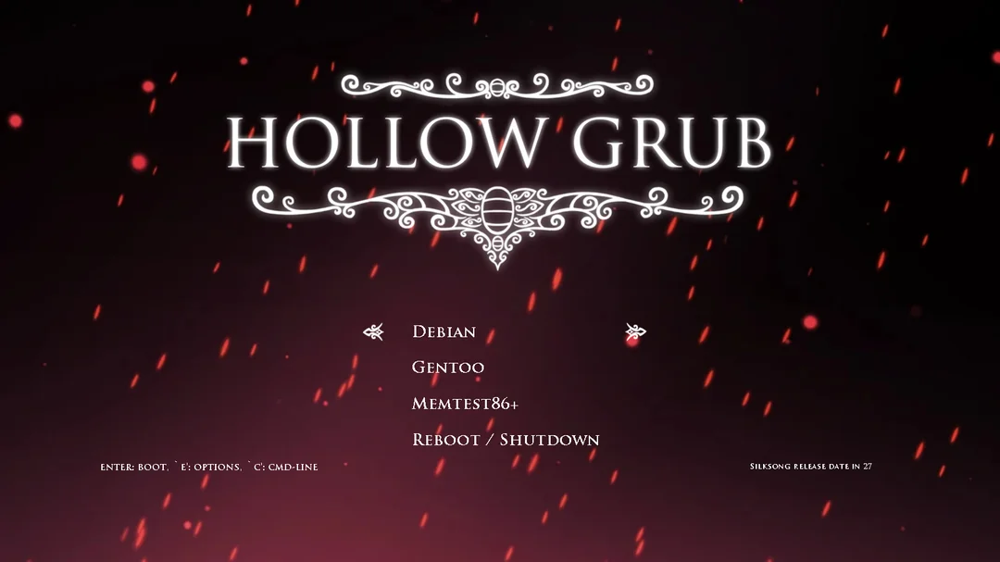
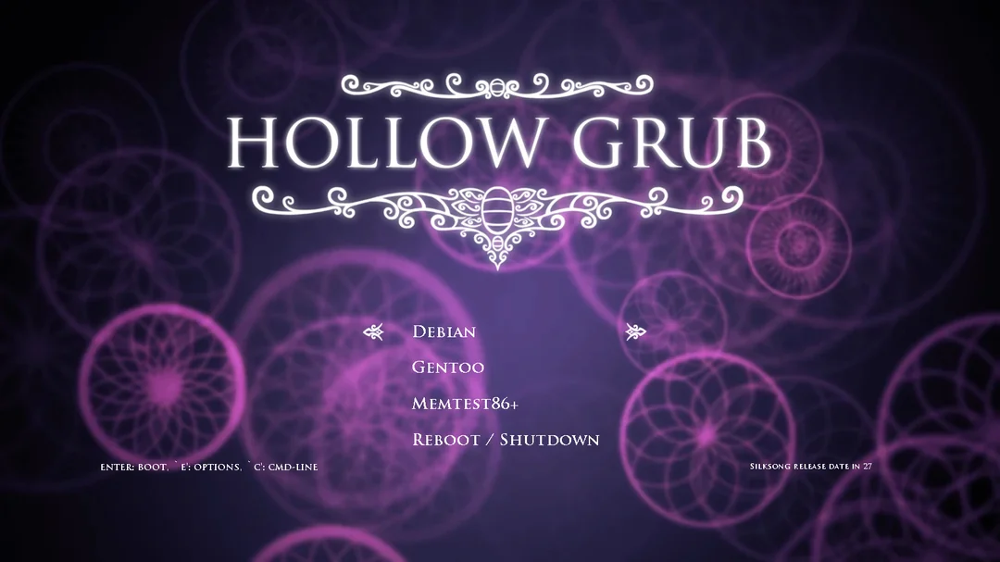

- [ ] terminal - kitty
- [ ] shell - zsh, pwsh7
- [ ] prompt - starship
- [ ] fetch - fastfetch, ufetch
- [ ] text editor - nvchad
- [ ]  file manager - nautilus
- [ ] browser - zen
- [ ] music visualizers - xyosc, cava
- [ ] music player - ncmpcpp, mpd
- [ ] ascii art - pybonsai, fortune, figlet, cowsay, sl, cmatrix, pipes.sh, shell color scripts, asciiquarium, ascii-rain, tty-clock, boxes, figlet, arttime, [terminal-rain-lightning](https://github.com/rmaake1/terminal-rain-lightning)
- [ ] websites - monkeytype
- [ ] app launcher - rofi [w/ root app launcher, battery, brightness, media controls, and logout menu](https://github.com/adi1090x/rofi)
- [ ] process manager - htop, btop
- [ ] notif daemon - dunst
- [ ] color schemes - wpgtk
- [ ] screen lock - swaylock, [insp 1](https://github.com/SeniorMatt/Hyprland-Waybar/blob/main/hypr/hyprlock.conf), [insp2](https://github.com/v81d/.gilded) 
- [ ] pdf reader - zathura
- [ ] greeter - ly
- [ ] boot - grub
		[dotfiles](https://github.com/sergoncano/hollow-knight-grub-theme)

**toolset**
- [ ] evillimiter 

**directory listers**
- [ ] eza
- [ ] lsd
- [ ] color ls
- [ ] logo-ls

**space managers**
- [ ] ncdu

**aliases**
- [ ] cat - bat
- [ ] ls - lsd 
- [ ] diff - delta
- [ ] git - lazygit
- [ ] df - duf
- [ ] find - fd
- [ ] grep - ripgrep
- [ ] *cheatsheets* - cheat
- [ ] *fuzzy finder* - fzf 
- [ ] man - tldr
- [ ] ping - gping 
- [ ] ps - procs
- [ ] cd - zoxide